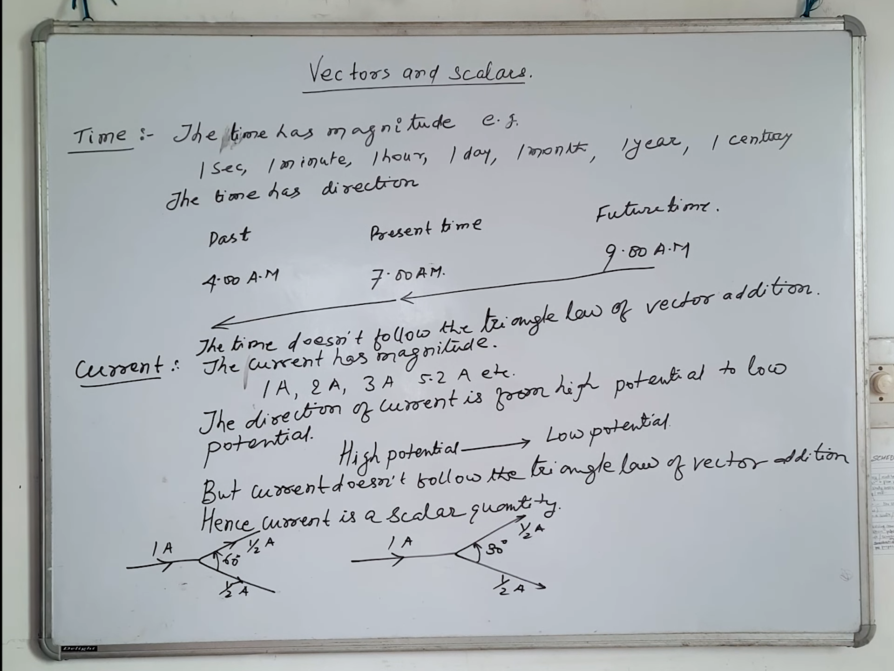

# Board Scanner

Make precise pdf notes of white board teaching style education.

## Installation

To install the required dependencies, use the command

```
pip install -r requirements.txt
```

Once all the dependencies are installed, go inside `scripts` folder <br />
**run-clean.sh** - Cleans the `output` folder <br />
**run-scan.sh** - Scans the board present in `raw` folder using a document-scanner <br />
**run-pdf-converter.sh** - Converts the scanner output in `output` folder into a PDF <br />

## Samples

### Input



### Output


## Real-world Deployment Example

One of the implementation of this technology is in this **Video Lecture** <br />
https://www.youtube.com/watch?v=esJMn2U9emY

Checkout it's generate **PDF Notes** using this project <br />
https://drive.google.com/file/d/1yYuV6xIRIecPxmsf4x8rz7541bFf9Jkz/edit
